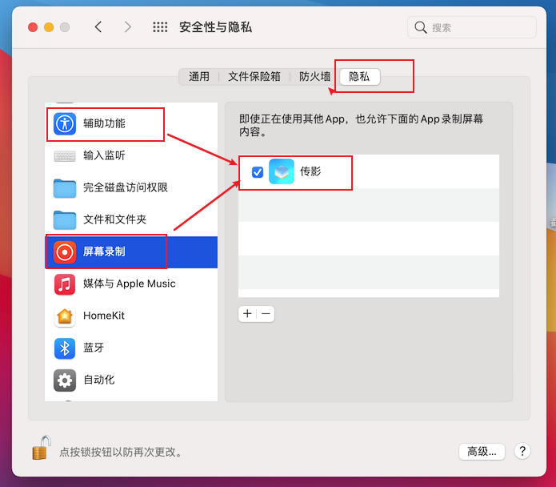

<p align="center">

</p>
<p align="center">
传影--所见即所得
<p>
<p align="center">

<p>

# 简介 

*从前*

想要制作证件照，需要先把图片用QQ传到电脑，再用PS手动抠图；

看到一句喜欢的话，想要记到电脑里，需要一个字一个字用键盘打出来；

看到黑板上老师写的公式，想要记到Word里，需要用MathType一点点打出来；

但是有没有可能，只用手机拍照，就能搞定上面所有的事，一步到位？

为了实现这个想法，我做了一些混合开发的尝试，于是便有了本项目：**传影--所见即所得**

# 预览

| 图片  |  文字  |  公式 |
| :------------: | :------------: | :------------: |
|   |    |   |

## 开始

> 注意：本项目目前只支持macOS

**请确保手机与电脑处在同一Wi-Fi下**

电脑端：打开assets目录下的[chanying.dmg](https://wwa.lanzoui.com/iPqznqm2dkd)，安装到macOS

手机端：Android、iOS安装包需自行打包（详见[开发](#开发)）


**设置辅助功能与屏幕录制白名单**

打开`设置->安全与隐私->隐私`，将传影添加至辅助功能与屏幕录制白名单



**确保你的macOS系统中存在python3环境**

在终端中输入`which python3`查看python3路径

```shell
> which python3
你的python3路径
```

若非`/usr/local/bin/python3`路径，请先建立软连接

`ln -s 你的python3路径 /usr/bin/local/python3`

**然后安装opencv依赖**

```python
pip3 install opencv-python
```

**传影已经准备就绪😊**

## 开发

> 假设你已安装配置好[Flutter](https://flutter.dev/docs/get-started/install)开发环境

首先克隆项目到本地，并在`lib/app/app.dart`文件里配置好相关应用id和key


然后获取项目依赖

```shell
flutter pub get
```

📦 打包Android应用

```shell
flutter build apk --release
```

📦 打包iOS应用

```shell
flutter build ios --release
```

📦 打包macOS应用

```shell
flutter build macos --release
```

## 声明

本项目严重参考自 [cyrildiagne](https://github.com/cyrildiagne) 的 [ar-cutpaste](https://github.com/cyrildiagne/ar-cutpaste)，并加入了对文字与公式识别的支持。

特别感谢 [cyrildiagne](https://github.com/cyrildiagne) 令人惊艳的想法和不可思议的实现。


